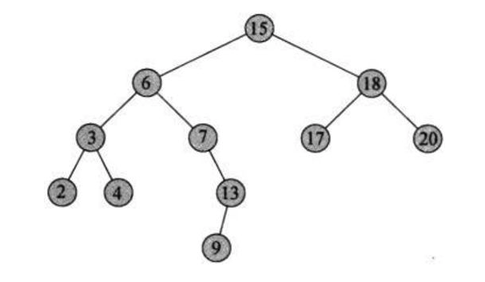

# AlgorithmReview
## Variable 
-  Add two number without using "+" method
-  Reverse the 3 digits integer
#### 1. Add two number without using "+" method;
##### method 1 -- while loop
```Java
//Java
public static int AddAToB(int a, int b){
  while (b != 0){
    int _a = a ^ b;
    /* ^ has another name -- Non-carry addition，
for it is an unfinished adding method. Thus, we
need to recalculate the carry unit using variable
_b.*/
    int _b = (a & b) << 1;
    /* _b is using for recquording which unit is
needed to be recalculated, for it only appears at
both unit of a and b are '1'. e.g. 00000110 &
00000100 = 00000100, so it is the third one not
carry to the forth unit. Thus we need to add the 1
in the forth unit, which means (a & b) << 1;*/
    a = _a;
    b = _b;
    /*it using b as the whole function controller,
that it safe because it would always be 0 at some
point, e.g. a = 01111111; b = 00000001; b would be
0 after a change to 10000000; */
  }
  return a;
}
/* why use static function: the static is not required,
but it is necessary for testing in main function, for
main function is a static function and it only allows
static function to be operated inside.  */
```
##### method 2 -- Recursive

```JS
//JS
let _a, _b
const addAToB = (a, b) => {
  _a = a ^ b
  _b = a & b
   a = _a
   if(!_b){
   //when _b is equal to zero, it means all carries 
   //are updated.
   return a
   }
   b = _b
   return addAToB(a, b)
   //return is important in every Reversive method,
   //without it, it will not get return value for 
   //the upper layer.
}
```
##### All Recursive methods need to be focused on two point:
- Stop condition. It would become a dead loop without that.
- Accumation between recursive methods, which means return the recursive-formula based function. The upper recursive function would not get its return value if lacking that "return"
#### 2. Reverse the 3 digits integer
```JS
//JS
let unit, new_num = 0
//new_num needed to be initialized 
const Reverser = num => {
const length = num.toString().length
  for(let i = 0; i <= length; i++){
    unit = num % 10
    num = num / 10
    new_num = new_num * 10 + unit
    /*that is the place to show why new_num need its
    initialization*/
  }
  return new_num  
}
/*
The common mistake is that put the num.toString().length directly into the
for(condition), that will cause the range change during this for-cycle; 
What is more, do not forget the initialization of new_num, for it would
return undefined in this case*/
```
### Deduplicated an Array
#### Given an array of integers, remove the duplicate numbers in it.

##### You should:

- Do it in place in the array.
- Move the unique numbers to the front of the array.
- Return the total number of the unique numbers.

```Java
public int deduplication(int[] nums) {
    // write your code here
    if(nums.length == 0){
        return 0;
    }
    Arrays.sort(nums);
    int n = 0;
    for(int i = 0; i < nums.length; i++){
        if(nums[n]!=nums[i]){
            nums[++n]=nums[i];
        }
    }

    // System.out.println(Arrays.toString(nums));
    return n + 1;
}  
```
##### The whole method is doing this thing:
###### - First, sorting the array to make all the members in the ascenting sequence, in that way the same members would be placed adjacent;
###### - Second, change the next different member into the place after the pervious renewed member. The arr[0] place would not be replace if this array is not empty, for is always should be shown in the renewed array.
###### - After all the replacement, the n is the record of how many exchange you have reached. But remember the arr[0] have not been changed, while this member should be calculated.

## String
### get the length of a String

```java
String str = "a string";
System.out.println(str.length());
//length vs. length()
//.length is used in an Array, and length() is used in a String
```
### The traverse of String
```Java
String str ="a string";
for(int i = 0; i < str.length(); i++){
char ch =str.charAt(i);
//...
}

```
## Algorithm
#### 1. Given a string, determine if it is a palindrome
```Java
/*
Description
Given a string, determine if it is a palindrome, considering only alphanumeric characters and ignoring cases.

Example 1:
Input: "A man, a plan, a canal: Panama"
Output: true
Explanation: "amanaplanacanalpanama"

Example 2:
Input: "race a car"
Output: false
Explanation: "raceacar"
*/
 
public static boolean isPalindrome(String str){
  str= str.toLowerCase();
  int i = 0;
  int j = str.length()-1;
  while(i < j){
    if(!Character.isLetterOrDigit(str.charAt(i))){
     i++;
     continue;
    }else if(!Character.isLetterOrDigit(str.charAt(j))){
     j--;
     continue;
    }else if(str.charAt(i) != str.charAt(j)){
        return false;
    }else{
        i++;
        j--;
    }   
  }
    return true;
}
```
#### 2. Given a string, convert it to an integer.

```Java
/*
Given a string, convert it to an integer. You may assume the string is a valid integer number that can be presented by a signed 32bit integer (-231 ~ 231-1).
Example 1:
	Input:  "123"
	Output: 123
	
	Explanation: 
	return the Integer.

Example 2:
	Input:  "2"
	Output: 2
	
	Explanation: 
	return the Integer.
*/
public int stringToInteger(String str) {
    // write your code here
    if(str == ""){
        return 0;
    }
    boolean flag = str.charAt(0) == '-';
    int startBit = flag ? 1 : 0;
    int digit, sum = 0;
    for(int i = startBit; i < str.length(); i++){
        digit = str.charAt(i) -'0';
        if(startBit == 1){
        sum = sum * 10 -digit;    
        }else{
           sum = sum * 10 + digit; 
        }
    }
    return sum;
}
```
#### Review Point
##### Always remember the "null" situation that needs to be considered.

## What is Object - Oriented ?
- Object-Oriented is a kind of world view
- Object-Oriented is a way to design program
### as an Object, it always has two things:
- attritube--member parameter
- behavior -- member function
## what is class
- Class is the abstract of Object. Object is an instance of the class.
- type of class name -- upper camel case
### constructor function
- has the same name of class
- does not have the return type, for it does not have return value
- cannot be visited from outside
- constructor function is called automatically when the object being initialized.
- constructor function has the overload（重载）
### this
- to avoid the misleading of parameter brought from outside and the class attributes.
- let the attributes always point to this object 
```Java
public class Example {
    public static void main(String[] args){
        Student stu = new Student("Jack", 89);
        stu.speak();

    }
}

class Student{
    public String name;
    public int score;
    public Student(String name, int score){
        this.name = name;
        score = score;// it would not get the 89 from outside, cause this is missing.
    }
     public void speak(){
        System.out.println(name +" "+ score);
     }
}
```
## Reference, List
### Algorithm
#### 1. Reverse Linked List
```Java
/**
 * Definition for ListNode
 * public class ListNode {
 *     int val;
 *     ListNode next;
 *     ListNode(int x) {
 *         val = x;
 *         next = null;
 *     }
 * }
 */

public class Solution {
    /**
     * @param head: n
     * @return: The new head of reversed linked list.
     */
    public ListNode reverse(ListNode head) {
        // write your code here
        ListNode pre = null;
        ListNode temp;
        while(head != null){
            temp = head.next;
            head.next = pre;
            pre = head;
            head = temp;
        }
        return pre;
    }
}
```
##### Remember to traverse all the LinkedList from head, if your are using a dummy point, then from dummy.next.
#### 2.Merge Two Sorted Lists
##### Merge two sorted (ascending) linked lists and return it as a new sorted list. The new sorted list should be made by splicing together the nodes of the two lists and sorted in ascending order.
```Java
/*
Example 1:
	Input: list1 = null, list2 = 0->3->3->null
	Output: 0->3->3->null


Example 2:
	Input:  list1 =  1->3->8->11->15->null, list2 = 2->null
	Output: 1->2->3->8->11->15->null
*/

/**
 * Definition for ListNode
 * public class ListNode {
 *     int val;
 *     ListNode next;
 *     ListNode(int x) {
 *         val = x;
 *         next = null;
 *     }
 * }
 */

public class Solution {
    /**
     * @param l1: ListNode l1 is the head of the linked list
     * @param l2: ListNode l2 is the head of the linked list
     * @return: ListNode head of linked list
     */
    public ListNode mergeTwoLists(ListNode l1, ListNode l2) {
        // write your code here
        ListNode dummy = new ListNode(-1);
        ListNode lastNode = dummy;
        
        while (l1 != null && l2 != null){
            if(l1.val < l2.val){
                lastNode.next = l1;
                l1 = l1.next;
            }else{
                lastNode.next = l2;
                l2 = l2.next; 
            }
            lastNode = lastNode.next;
        }
        if(l1 != null){
            lastNode.next = l1;
        }else{
            lastNode.next = l2;
        }
        
    return dummy.next;    
    }
}
```
#### 3.Remove Linked List Elements
##### Remove all elements from a linked list of integers that have value val.
```Java
/*
Example 1:

Input: head = 1->2->3->3->4->5->3->null, val = 3
Output: 1->2->4->5->null
Example 2:

Input: head = 1->1->null, val = 1
Output: null
*/

/**
 * Definition for ListNode
 * public class ListNode {
 *     int val;
 *     ListNode next;
 *     ListNode(int x) {
 *         val = x;
 *         next = null;
 *     }
 * }
 */

public class Solution {
    /**
     * @param head: a ListNode
     * @param val: An integer
     * @return: a ListNode
     */
    public ListNode removeElements(ListNode head, int val) {
        // write your code here
        ListNode dummy = new ListNode(-1);
        dummy.next = head;
        ListNode lastNode = dummy;
        while(lastNode.next != null){
            if(lastNode.next.val == val){
                lastNode.next = lastNode.next.next;
            }else{
                lastNode = lastNode.next; 
            }
        }
        return dummy.next;
    }
}
```
#### 4. Insert Node in Sorted Linked List
```Java
/**
 * Definition for ListNode
 * public class ListNode {
 *     int val;
 *     ListNode next;
 *     ListNode(int x) {
 *         val = x;
 *         next = null;
 *     }
 * }
 */

public class Solution {
    /**
     * @param head: The head of linked list.
     * @param val: An integer.
     * @return: The head of new linked list.
     */
    public ListNode insertNode(ListNode head, int val) {
        // write your code here
        ListNode dummy = new ListNode(-1);
        ListNode newNode = new ListNode(val);
        dummy.next = head;
        ListNode lastNode = dummy;
        while(lastNode.next != null && lastNode.next.val <= val){
            lastNode = lastNode.next;
        }
        newNode.next = lastNode.next;
        lastNode.next = newNode;
        return dummy.next;
        
    }
}
```
##### Remember how to insert a node into a linkedList
1. newNode.next = preNode.next.next;
// It is not newNode = preNode.next.next -- **wrong way**
3. preNode.next = newNode;

## 双指针算法 -- 不是算法的算法
### 相向双指针：
1. ##### 一个典型的相向双指针问题 -- 翻转字符串
> #### 要把大象装冰箱总共分几步 -- 三步
- #### `swap(left, right)`
- #### `left++`
- #### `right--`
```js
const ReverseString = str => {
  strArray = str.split("");
  let left = 0 ; let right = strArray.length - 1;
  while(left < right){
    let temp = strArray[left];
    strArray[left] = strArray[right];
    strArray[right] = temp;
    left++;
    right--;
  }
  return strArray.join("");
}
```
2. ##### 给一个整数数组，找到两个数使得他们的和等于一个给定的数 target。返回这两个数。
> #### 使用哈希表来解决 -- JS(ES6) 也有Set和Map, 哈哈哈哈哈
```js
const TwoSum = (numArray, target) => {
  const set = new Set();
  for(i = 0; i < numArray.length; i++){
    if(set.has(numArray[i])){
      return [numArray[i], target - numArray[i]];
    }
    set.add(target - numArray[i]);
  }
  return null;
}

```
> #### 使用双指针算法解决
```js
const twoSum = (numArray, target) => {
  numArray.sort();
  let left = 0; let right = numArray.length - 1;
  while(left < right){
    if(numArray[left] + numArray[right] == target){
      return [numArray[left], numArray[right]];
    }
    else if(numArray[left] + numArray[right] < target){
      left++;
    }
    else{
      right--;
    }
  }
  return null;
}
```
### 同向双指针
#### 1. 数组去重
> #### O(nlogn) time, O(1) extra space 
```jsx
const removeDuplicates = function(nums) {
  // nums.sort();
  let slowPointer = 0;
  for(i = 0; i < nums.length; i++){
      if(nums[i] != nums[slowPointer]){
          nums[++slowPointer] = nums[i];
      }
  }
  while(nums.length > slowPointer + 1){
      nums.pop();
  }
  // console.log(nums);
  return nums;
};
```
## BFS -- 宽度优先搜索

#### Question： 图上的宽度优先搜索与树上的宽度优先搜索的区别？
#### Answer：图上的点会成环, 所以要记录点是否已经查过

```js
/**
 * // Definition for a Node.
 * function Node(val,neighbors) {
 *    this.val = val;
 *    this.neighbors = neighbors;
 * };
 */
/**
 * @param {Node} node
 * @return {Node}
 */
var cloneGraph = function(node) {
  const map = new Map();
  const old = getNode(node);
  //copy nodes
  for(let node of old){
    map.set(node, new Node(node.val, []))
  }
  //copy neighbors(edges)
  for(let node of old){
    let newNode = map.get(node);
    for(let neighbor of node.neighbors){
      newNeighbor = map.get(neighbor)
      newNode.neighbors.push(newNeighbor)
      // Why need to push every newNeighbor into newWode.neighbors.push() -- you need to copy values, not copy reference.
    }
  }
  return map.get(node)    
};

const getNode = node => {
  const queue = []; // remain all the nodes in the graph for level control
  const set = new Set(); // record for every node.
  queue.push(node);
  set.add(node);
  while(queue.length){
    const node = queue.shift();
    for(let neighbor of node.neighbors){
      if(!set.has(neighbor)){
        queue.push(neighbor);
        set.add(neighbor);
      }
    }
  }
  return set;
}
```
#### Attention point: 增强for循环js：
循环key: `for(key in array){...}`
循环value: `for(value of array){...}`

### BST 图的问题的时间复杂度：O(N+M): N 为点数， M为边数

---------
## 你以为很简单的二分法
---------
### 二分法(binary search)是面试中常见的算法。如果你的学校有算法课，那么你可能已经学习过二分这个算法了。

### 但是很多同学在二分法的问题上，依然无法熟练掌握，以下问题经常会不断发生：

1.  #### 写出来的二分法总是死循环
2.  #### start + 1 < end 还是 start <= end 还是 start < end 总是搞不清楚
3.  #### start = mid + 1 还是 start = mid 也总是搞不清楚

### 在这一章的学习中，我们要会学到：

*   #### 一个通用的二分模板
*   #### 为什么会出现死循环
*   #### 哪些题目可以用二分法来做
*   #### 通过时间复杂度倒推算法的技巧
*   #### 其他的 Log N 算法（倍增法，辗转相除法，快速幂算法）

### 先修内容有：

*   #### 基本的二分法该如何写
*   #### 第一个位置，最后一个位置该如何变化
*   #### Big O，时间复杂度，空间复杂度
*   #### 什么是递归，二分法用递归如何实现
*   #### 内存中的栈空间和堆空间有什么区别
*   #### 什么是 Stack Overflow，什么情况下会造成 Stack Overflow

### 补充内容有：

*   #### 三步翻转法
*   #### 递增矩阵找数
*   #### 快速幂算法
*   #### 辗转相除法
------
### 时间复杂度
------
### 时间复杂度是面试中必问的问题。学好时间复杂度，有如下的帮助：

1.  #### 面试官会问你的算法时间复杂度是什么
2.  #### 当面试官说，有没有更好的方法时，你知道朝什么样的复杂度优化
3.  #### 利用时间复杂度倒推算法是面试常用技巧。如O(logN)O(logN)的算法几乎可以确定是二分法。

### 时间复杂度计算的要点：

*   #### **只包含多项式的最高次项**。这是因为在复杂度计算中，最高次项对运行时间有决定性的作用，次高次项可以忽略不计。例如f(n) = n^2 + nf(n)=n2+n， 此时n这一项对于多项式的值的影响想对于n^2可以忽略不计。在定性的描述中，我们只取最高次项。
*   #### **不包含多项式最高次项的系数**。对于最高次项，我们忽略它的系数，在算法中，我们称之为常数。上面代码中，常数是2,但是时间复杂度的计算，我们只取O(n)。

--------
### 面试中常见算法的时间复杂度
--------
算法中，常见的时间复杂度有：

|复杂度|可能对应的算法|备注
---|:--:|---
O(1)|位运算|常数级复杂度，一般面试中不会有

O(logn)|二分法，倍增法，快速幂算法，辗转相除法| |

O(n)|枚举法，双指针算法，单调栈算法，KMP算法，Rabin Karp，Manacher's Algorithm|又称作线性时间复杂度

O(nlogn)|快速排序，归并排序，堆排序| |

O(n^2)|枚举法，动态规划，Dijkstra| |

O(n^3)|枚举法，动态规划，Floyd| |

O(2^n)|与组合有关的搜索问题| |

O(n!)|与排列有关的搜索问题| |

#### 在面试中，经常会涉及到时间复杂度的计算。当你在对于一个问题给出一种解法之后，面试官常会进一步询问，是否有更优的方法。此时就是在问你是否有时间复杂度更小的方法（有的时候也要考虑空间复杂度更小的方法），这个时候需要你对常用的数据结构操作和算法的时间复杂度有清晰的认识，从而分析出可优化的部分，给出更优的算法。

#### 例如，给定一个已经排序的数组，现在有多次询问，每次询问一个数字是否在这个数组中，返回True or False.

*   #### 方法1： 每次扫描一遍数组，查看是否存在。  
    #### 这个方法，每次查询的时间复杂度是:O(n)。
    
*   #### 方法2：由于已经有序，可以使用二分查找的方法。  
    #### 这个方法，每次查询的时间复杂度是:O(logn)。
    
*   #### 方法3：将数组中的数存入Hashset。  
    #### 这个方法，每次查询的时间复杂度是:O(1)。
    

#### 可以看到，上述的三种方法是递进的，时间复杂度越来越小。

#### 在面试中还有很多常见常用的方法，他们的时间复杂度并不是固定的，都需要掌握其时间复杂度的分析，要能够根据算法过程自己推算出时间复杂度。
---------
## 你以为很简单的二分法
---------
### 二分法(binary search)是面试中常见的算法。如果你的学校有算法课，那么你可能已经学习过二分这个算法了。

### 但是很多同学在二分法的问题上，依然无法熟练掌握，以下问题经常会不断发生：

1.  #### 写出来的二分法总是死循环
2.  #### start + 1 < end 还是 start <= end 还是 start < end 总是搞不清楚
3.  #### start = mid + 1 还是 start = mid 也总是搞不清楚

### 在这一章的学习中，我们要会学到：

*   #### 一个通用的二分模板
*   #### 为什么会出现死循环
*   #### 哪些题目可以用二分法来做
*   #### 通过时间复杂度倒推算法的技巧
*   #### 其他的 Log N 算法（倍增法，辗转相除法，快速幂算法）

### 先修内容有：

*   #### 基本的二分法该如何写
*   #### 第一个位置，最后一个位置该如何变化
*   #### Big O，时间复杂度，空间复杂度
*   #### 什么是递归，二分法用递归如何实现
*   #### 内存中的栈空间和堆空间有什么区别
*   #### 什么是 Stack Overflow，什么情况下会造成 Stack Overflow

### 补充内容有：

*   #### 三步翻转法
*   #### 递增矩阵找数
*   #### 快速幂算法
*   #### 辗转相除法
------
### 时间复杂度
------
### 时间复杂度是面试中必问的问题。学好时间复杂度，有如下的帮助：

1.  #### 面试官会问你的算法时间复杂度是什么
2.  #### 当面试官说，有没有更好的方法时，你知道朝什么样的复杂度优化
3.  #### 利用时间复杂度倒推算法是面试常用技巧。如O(logN)O(logN)的算法几乎可以确定是二分法。

### 时间复杂度计算的要点：

*   #### **只包含多项式的最高次项**。这是因为在复杂度计算中，最高次项对运行时间有决定性的作用，次高次项可以忽略不计。例如f(n) = n^2 + nf(n)=n2+n， 此时n这一项对于多项式的值的影响想对于n^2可以忽略不计。在定性的描述中，我们只取最高次项。
*   #### **不包含多项式最高次项的系数**。对于最高次项，我们忽略它的系数，在算法中，我们称之为常数。上面代码中，常数是2,但是时间复杂度的计算，我们只取O(n)。

--------
### 面试中常见算法的时间复杂度
--------
算法中，常见的时间复杂度有：

|复杂度|可能对应的算法|备注
---|:--:|---
O(1)|位运算|常数级复杂度，一般面试中不会有

O(logn)|二分法，倍增法，快速幂算法，辗转相除法| |

O(n)|枚举法，双指针算法，单调栈算法，KMP算法，Rabin Karp，Manacher's Algorithm|又称作线性时间复杂度

O(nlogn)|快速排序，归并排序，堆排序| |

O(n^2)|枚举法，动态规划，Dijkstra| |

O(n^3)|枚举法，动态规划，Floyd| |

O(2^n)|与组合有关的搜索问题| |

O(n!)|与排列有关的搜索问题| |

#### 在面试中，经常会涉及到时间复杂度的计算。当你在对于一个问题给出一种解法之后，面试官常会进一步询问，是否有更优的方法。此时就是在问你是否有时间复杂度更小的方法（有的时候也要考虑空间复杂度更小的方法），这个时候需要你对常用的数据结构操作和算法的时间复杂度有清晰的认识，从而分析出可优化的部分，给出更优的算法。

#### 例如，给定一个已经排序的数组，现在有多次询问，每次询问一个数字是否在这个数组中，返回True or False.

*   #### 方法1： 每次扫描一遍数组，查看是否存在。  
    #### 这个方法，每次查询的时间复杂度是:O(n)。
    
*   #### 方法2：由于已经有序，可以使用二分查找的方法。  
    #### 这个方法，每次查询的时间复杂度是:O(logn)。
    
*   #### 方法3：将数组中的数存入Hashset。  
    #### 这个方法，每次查询的时间复杂度是:O(1)。
    

#### 可以看到，上述的三种方法是递进的，时间复杂度越来越小。

#### 在面试中还有很多常见常用的方法，他们的时间复杂度并不是固定的，都需要掌握其时间复杂度的分析，要能够根据算法过程自己推算出时间复杂度。

-------
### 什么是空间复杂度
-------
#### 类似于时间复杂度，空间复杂度就是衡量算法运行时所占用的临时存储空间的度量。也是一个与问题规模nn有关的函数。  
#### 我们同样使用O(大写字母o)O(大写字母o)来标记。

#### 算法所占用的空间主要有三个方面：算法代码本身占用的空间、输入输出数据占用的空间、算法运行时临时占用的空间。  
#### 其中，代码本身和输入输出数据占用的空间不是算法空间复杂度考虑的范围内，空间复杂度只考虑运行时临时占用的空间，又称为算法的额外空间（Extra space）。

#### 临时占用的空间包括：

*   #### 为参数列表中形参变量分配的空间
*   #### 为函数体中局部变量分配的空间  
（如果是递归函数，需要将上述两部分占用空间的和乘以递归的深度，这是堆栈空间，在下面小节中详细讲解这部分）
#### 在面试中，很多时候面试官给出的问题会附带一个“不能使用多余的空间”这样的要求。很多时候这是在要求你的空间复杂度只能是O(1)的，也就是你只能开几个辅助变量，而不能开大数组。

#### 其他常见的还有，分析一下你的算法空间复杂度，寻找空间复杂度更优的解法等。  
#### 一般来说，算法占用的时间和空间会是两个互相平衡的元素，有的时候我们牺牲空间来换取时间，有的时候我们牺牲时间来换取空间。

#### 在面试中常见算法的空间复杂度：

*   快速排序： 最优：O(logn)O(logn)，最差:O(n)
*   二分查找：O(1)
*   最短路(Dijkstra)算法：O(V)(V表示点集大小)

#### 在递归函数中，除了变量和数组所开辟的临时空间以外，还有一个空间我们需要纳入考虑，就是递归时占用的栈空间（Stack）。

#### 递归函数需要保存当前的环境，以便在递归返回的时候能够还原之前的现场。因此递归的深度越深，所要占用的栈空间越大。当空间超出一定范围的时候就会出现程序**爆栈**（Stack Overflow）的情况。

#### 很多博客文章中会写堆栈空间与递归调用的次数成正比，这个是不完全正确的，应该是与递归的深度成正比（此处只讨论单线程）。  
#### 因为递归在返回到上一层的时侯，就会将本层的空间释放，因此占用的栈空间不会比最深的一次调用所占用的空间更多。

### 大部分的空间复杂度计算方法

累加下面两个部分的内容即是你代码的空间复杂度：

#### 1.你的代码里开辟了多少新的空间（new 了多少新的内容出来）
#### 2. 你的递归深度 * 递归函数内部的参数和局部变量所占用的空间

### 以快速排序为例子

### 快速排序的思路如下：  
#### 1.选择一个基准元素，将原数组分为两部分，左边部分小于该元素，右边部分大于该元素。  
#### 2.分别递归处理左边和右边。

*   #### 最好情况：  
    #### 每次都能恰好将数组分成左右相同长度的两部分，需要的递归深度是:lgn，每次将数组分成两部分时，我们选择不使用辅助数组，在原数组上“就地”处理，所以每层的空间是O(1)。  
    #### 因此总的复杂度是:O(logn)
    
*   #### 最差情况：  
    #### 每次都将数组分成长度差最大的两部分，即一边只有一个元素，其余的在另外一边，最大深度为：n， 因此空间复杂度为:O(n)。
    

#### 有些递归算法的空间复杂度是稳定的，不会退化，快排的递归深度与其每次选择的“基准值”有很大关系，因此存在退化的情况。
## 你以为很简单的二分法
---------
### 二分法(binary search)是面试中常见的算法。如果你的学校有算法课，那么你可能已经学习过二分这个算法了。

### 但是很多同学在二分法的问题上，依然无法熟练掌握，以下问题经常会不断发生：

1.  #### 写出来的二分法总是死循环
2.  #### start + 1 < end 还是 start <= end 还是 start < end 总是搞不清楚
3.  #### start = mid + 1 还是 start = mid 也总是搞不清楚

### 在这一章的学习中，我们要会学到：

*   #### 一个通用的二分模板
*   #### 为什么会出现死循环
*   #### 哪些题目可以用二分法来做
*   #### 通过时间复杂度倒推算法的技巧
*   #### 其他的 Log N 算法（倍增法，辗转相除法，快速幂算法）

### 先修内容有：

*   #### 基本的二分法该如何写
*   #### 第一个位置，最后一个位置该如何变化
*   #### Big O，时间复杂度，空间复杂度
*   #### 什么是递归，二分法用递归如何实现
*   #### 内存中的栈空间和堆空间有什么区别
*   #### 什么是 Stack Overflow，什么情况下会造成 Stack Overflow

### 补充内容有：

*   #### 三步翻转法
*   #### 递增矩阵找数
*   #### 快速幂算法
*   #### 辗转相除法
------
### 时间复杂度
------
### 时间复杂度是面试中必问的问题。学好时间复杂度，有如下的帮助：

1.  #### 面试官会问你的算法时间复杂度是什么
2.  #### 当面试官说，有没有更好的方法时，你知道朝什么样的复杂度优化
3.  #### 利用时间复杂度倒推算法是面试常用技巧。如O(logN)O(logN)的算法几乎可以确定是二分法。

### 时间复杂度计算的要点：

*   #### **只包含多项式的最高次项**。这是因为在复杂度计算中，最高次项对运行时间有决定性的作用，次高次项可以忽略不计。例如f(n) = n^2 + nf(n)=n2+n， 此时n这一项对于多项式的值的影响想对于n^2可以忽略不计。在定性的描述中，我们只取最高次项。
*   #### **不包含多项式最高次项的系数**。对于最高次项，我们忽略它的系数，在算法中，我们称之为常数。上面代码中，常数是2,但是时间复杂度的计算，我们只取O(n)。

--------
### 面试中常见算法的时间复杂度
--------
算法中，常见的时间复杂度有：

|复杂度|可能对应的算法|备注
---|:--:|---
O(1)|位运算|常数级复杂度，一般面试中不会有

O(logn)|二分法，倍增法，快速幂算法，辗转相除法| |

O(n)|枚举法，双指针算法，单调栈算法，KMP算法，Rabin Karp，Manacher's Algorithm|又称作线性时间复杂度

O(nlogn)|快速排序，归并排序，堆排序| |

O(n^2)|枚举法，动态规划，Dijkstra| |

O(n^3)|枚举法，动态规划，Floyd| |

O(2^n)|与组合有关的搜索问题| |

O(n!)|与排列有关的搜索问题| |

#### 在面试中，经常会涉及到时间复杂度的计算。当你在对于一个问题给出一种解法之后，面试官常会进一步询问，是否有更优的方法。此时就是在问你是否有时间复杂度更小的方法（有的时候也要考虑空间复杂度更小的方法），这个时候需要你对常用的数据结构操作和算法的时间复杂度有清晰的认识，从而分析出可优化的部分，给出更优的算法。

#### 例如，给定一个已经排序的数组，现在有多次询问，每次询问一个数字是否在这个数组中，返回True or False.

*   #### 方法1： 每次扫描一遍数组，查看是否存在。  
    #### 这个方法，每次查询的时间复杂度是:O(n)。
    
*   #### 方法2：由于已经有序，可以使用二分查找的方法。  
    #### 这个方法，每次查询的时间复杂度是:O(logn)。
    
*   #### 方法3：将数组中的数存入Hashset。  
    #### 这个方法，每次查询的时间复杂度是:O(1)。
    

#### 可以看到，上述的三种方法是递进的，时间复杂度越来越小。

#### 在面试中还有很多常见常用的方法，他们的时间复杂度并不是固定的，都需要掌握其时间复杂度的分析，要能够根据算法过程自己推算出时间复杂度。

-------
### 什么是空间复杂度
-------
#### 类似于时间复杂度，空间复杂度就是衡量算法运行时所占用的临时存储空间的度量。也是一个与问题规模nn有关的函数。  
#### 我们同样使用O(大写字母o)O(大写字母o)来标记。

#### 算法所占用的空间主要有三个方面：算法代码本身占用的空间、输入输出数据占用的空间、算法运行时临时占用的空间。  
#### 其中，代码本身和输入输出数据占用的空间不是算法空间复杂度考虑的范围内，空间复杂度只考虑运行时临时占用的空间，又称为算法的额外空间（Extra space）。

#### 临时占用的空间包括：

*   #### 为参数列表中形参变量分配的空间
*   #### 为函数体中局部变量分配的空间  
（如果是递归函数，需要将上述两部分占用空间的和乘以递归的深度，这是堆栈空间，在下面小节中详细讲解这部分）
#### 在面试中，很多时候面试官给出的问题会附带一个“不能使用多余的空间”这样的要求。很多时候这是在要求你的空间复杂度只能是O(1)的，也就是你只能开几个辅助变量，而不能开大数组。

#### 其他常见的还有，分析一下你的算法空间复杂度，寻找空间复杂度更优的解法等。  
#### 一般来说，算法占用的时间和空间会是两个互相平衡的元素，有的时候我们牺牲空间来换取时间，有的时候我们牺牲时间来换取空间。

#### 在面试中常见算法的空间复杂度：

*   快速排序： 最优：O(logn)O(logn)，最差:O(n)
*   二分查找：O(1)
*   最短路(Dijkstra)算法：O(V)(V表示点集大小)

#### 在递归函数中，除了变量和数组所开辟的临时空间以外，还有一个空间我们需要纳入考虑，就是递归时占用的栈空间（Stack）。

#### 递归函数需要保存当前的环境，以便在递归返回的时候能够还原之前的现场。因此递归的深度越深，所要占用的栈空间越大。当空间超出一定范围的时候就会出现程序**爆栈**（Stack Overflow）的情况。

#### 很多博客文章中会写堆栈空间与递归调用的次数成正比，这个是不完全正确的，应该是与递归的深度成正比（此处只讨论单线程）。  
#### 因为递归在返回到上一层的时侯，就会将本层的空间释放，因此占用的栈空间不会比最深的一次调用所占用的空间更多。

### 大部分的空间复杂度计算方法

累加下面两个部分的内容即是你代码的空间复杂度：

#### 1.你的代码里开辟了多少新的空间（new 了多少新的内容出来）
#### 2. 你的递归深度 * 递归函数内部的参数和局部变量所占用的空间

### 以快速排序为例子

### 快速排序的思路如下：  
#### 1.选择一个基准元素，将原数组分为两部分，左边部分小于该元素，右边部分大于该元素。  
#### 2.分别递归处理左边和右边。

*   #### 最好情况：  
    #### 每次都能恰好将数组分成左右相同长度的两部分，需要的递归深度是:lgn，每次将数组分成两部分时，我们选择不使用辅助数组，在原数组上“就地”处理，所以每层的空间是O(1)。  
    #### 因此总的复杂度是:O(logn)
    
*   #### 最差情况：  
    #### 每次都将数组分成长度差最大的两部分，即一边只有一个元素，其余的在另外一边，最大深度为：n， 因此空间复杂度为:O(n)。
    

#### 有些递归算法的空间复杂度是稳定的，不会退化，快排的递归深度与其每次选择的“基准值”有很大关系，因此存在退化的情况。

-----
分解质因数
-----
#### 以(n)^(1/2)为时间复杂度的算法并不多见，最具代表性的就是分解质因数了。
### 具体步骤

#### 1.  记up = (n)^(1/2)，作为质因数k的上界, 初始化k=2。
#### 2.  当k <= up且 n不为1 时，执行步骤3，否则执行步4。
#### 3.  当n被k整除时，不断整除并覆盖n，同时结果中记录k，直到n不能整出k为止。之后k自增，执行步骤2。
#### 4.  当n不为1时，把n也加入结果当中，算法结束。

### 几点解释

#### *   不需要判定k是否为质数，如果k不为质数，且能整出n时，n早被k的因数所除。故能整除n的k必是质数。
#### *   为何引入up？为了优化性能。当k大于up时，k已不可能整除n，除非k是n自身。也即为何步骤4判断n是否为1，n不为1时必是比up大的质数。
#### *   步骤2中，也判定n是否为1，这也是为了性能，当n已为1时，可早停。

```java
public List<Integer> primeFactorization(int n) {
    List<Integer> result = new ArrayList<>();
    int up = (int) Math.sqrt(n);
    
    for (int k = 2; k <= up && n > 1; ++k) {
        while (n % k == 0) {
            n /= k;
            result.add(k);
        }
    }
    
    if (n > 1) {
        result.add(n);
    }
    
    return result;
}
```
### 复杂度分析
#### 最坏时间复杂度 On)^(1/2)。当n为质数时，取到其最坏时间复杂度。
#### 空间复杂度 O(log(n))，当n质因数很多时，需要空间大，但总不会多于O(log(n))个。
--------
内存中的栈空间与堆空间
--------
####  简而言之可以这么区别栈空间和堆空间：

> #### new 出来的就放在堆空间，其他都是栈空间
### 什么是递归深度

递归深度就是**递归函数在内存中，同时存在的最大次数**。  
例如下面这段求阶乘的代码：
```java
int factorial(int n) {
    if (n == 1) {
        return 1;
    }
    return factorial(n - 1) * n;
}
```
#### 太深的递归会内存溢出
#### 首先，函数本身也是在内存中占空间的，主要用于存储传递的参数，以及调用代码的返回地址。
#### 函数的调用，会在内存的栈空间中开辟新空间，来存放子函数。递归函数更是会不断占用栈空间，例如该阶乘函数，展开到最后n=1时，内存中会存在factorial(100), factorial(99), factorial(98) ... factorial(1)这些函数，它们从栈底向栈顶方向不断扩展。
#### 当递归过深时，栈空间会被耗尽，这时就无法开辟新的函数，会报出stack overflow这样的错误。
#### 所以，在考虑空间复杂度时，递归函数的深度也是要考虑进去的。

为什么 start < end 容易出现死循环
-----------------------
#### 许多同学在写二分法的时候，都比较习惯性的写`while (start < end)`这样的循环条件。这样的写法及其容易出现死循环，导致 LintCode 上的测试“超时”（Time Limit Exceeded）。
#### 什么情况下会出现死循环？

#### 在做`last position of target`这种模型下的二分法时，使用 while (start < end) 就容易出现超时。

#### 我们来看看会超时的代码：
```java
int start = 0, end = nums.length - 1;
while (start < end) {
    int mid = start + (end - start) / 2;
    if (nums[mid] == target) {
        start = mid;
    } else if (nums[mid] < target) {
        start = mid + 1;
    } else {
        end = mid - 1;
    }
}
```

nums = [1,1], target = 1

    
将数据带入过一下代码：
    

start = 0, end = 1  
while (0 < 1) {  
mid = 0 + (1 - 0) / 2 = 0  
if (nums\[0\] == 1) {  
start = 0;  
}  
...  
}

    
我们发现，start 将始终是 `0`。
    
出现这个问题的主要原因是，mid = start + (end - start) / 2 这种写法是偏向start的。也就是说 mid 是中间偏左的位置。这样导致如果 start 和 end 已经是相邻关系，会导致 start 有可能在一轮循环之后保持不变。
    
或许你会说，那么我改成 mid = (start + end + 1) / 2 是否能解决问题呢？没错，确实可以解决 last position of target 的问题，但是这样之后 first position of target 就超时了。我们比较希望能够有一个理想的模板，无论是 first position of target 还是 last position of target，代码的区别尽可能的小和容易记住。

 ------
 ### 模板代码剖析 
 ------
```java
public class Solution {
    /**
     * @param A an integer array sorted in ascending order
     * @param target an integer
     * @return an integer
     */
    public int findPosition(int[] nums, int target) {
        if (nums == null || nums.length == 0) {
            return -1;
        }
        
        int start = 0, end = nums.length - 1;
        // 要点1: start + 1 < end
        while (start + 1 < end) {
	    // 要点2：start + (end - start) / 2
            int mid = start + (end - start) / 2;
            // 要点3：=, <, > 分开讨论，mid 不+1也不-1
            if (nums[mid] == target) {
                return mid;
            } else if (nums[mid] < target) {
                start = mid;
            } else {
                end = mid;
            }
        }
        
        // 要点4: 循环结束后，单独处理start和end
        if (nums[start] == target) {
            return start;
        }
        if (nums[end] == target) {
            return end;
        }
        return -1;
    }
}
```
#### 常见问题
##### Q: 为什么要用 start + 1 < end？而不是 start < end 或者 start <= end？

##### A: 为了避免死循环。二分法的模板中，整个程序架构分为两个部分：

##### 通过 while 循环，将区间范围从 n 缩小到 2 （只有 start 和 end 两个点）。
##### 在 start 和 end 中判断是否有解。
##### start < end 或者 start <= end 在寻找目标最后一次出现的位置的时候，出现死循环。

##### Q: 为什么明明可以 start = mid + 1 偏偏要写成 start = mid?

##### A: 大部分时候，mid 是可以 +1 和 -1 的。在一些特殊情况下，比如寻找目标的最后一次出现的位置时，当 target 与 nums[mid] 相等的时候，是不能够使用 mid + 1 或者 mid - 1 的。因为会导致漏掉解。那么为了节省脑力，统一写成 start = mid / end = mid 并不会造成任何解的丢失，并且也不会损失效率——log(n) 和 log(n+1) 没有区别。

## 二叉树中的分治法与遍历法
------------
在这一章节的学习中，我们将要学习一个数据结构——`二叉树`（Binary Tree），和基于二叉树上的搜索算法。

在二叉树的搜索中，我们主要使用了分治法（Divide Conquer）来解决大部分的问题。之所以大部分二叉树的问题可以使用分治法，是因为二叉树这种数据结构，是一个天然就帮你做好了分治法中“分”这个步骤的结构。

本章节的先修内容有：

*   什么是递归（Recursion）—— 请回到第二章节中复习
*   递归（Recursion）、回溯（Backtracking）和搜索（Search）的联系和区别
*   分治法（Divide and Conquer）和遍历法（Traverse）的联系和区别
*   什么是结果类 ResultType，什么时候使用 ResultType
*   什么是二叉查找树（Binary Search Tree）
*   什么是平衡二叉树（Balanced Binary Tree）

本章节的补充内容有：

*   Morris 算法：使用 O(1) 的额外空间复杂度对二叉树进行先序遍历（Preorder Traversal）
*   用非递归的方法实现先序遍历，中序遍历和后序遍历
*   二叉查找树（Binary Search Tree）的增删查改
*   Java 自带的平衡排序二叉树 TreeMap / TreeSet 的介绍和面试中的应用

### 定义

遍历（Traversal），顾名思义，就是`通过某种顺序，一个一个访问一个数据结构中的元素`。比如我们如果需要遍历一个数组，无非就是要么从前往后，要么从后往前遍历。但是对于一棵二叉树来说，他就有很多种方式进行遍历：

1.  层序遍历（Level order）
2.  先序遍历（Pre order）
3.  中序遍历（In order）
4.  后序遍历（Post order）

我们在之前的课程中，已经学习过了二叉树的层序遍历，也就是使用 BFS 算法来获得二叉树的分层信息。通过 BFS 获得的顺序我们也可以称之为 BFS Order。而剩下的三种遍历，都需要通过深度优先搜索的方式来获得。而这一小节中，我们将讲一下通过深度优先搜索（DFS）来获得的节点顺序，

### 先序遍历 / 中序遍历 / 后序遍历

#### 先序遍历（又叫先根遍历、前序遍历）

首先访问根结点，然后遍历左子树，最后遍历右子树。**遍历左、右子树时，仍按先序遍历**。若二叉树为空则返回。

该过程可简记为**根左右**，注意该过程是**递归的**。如图先序遍历结果是：**ABDECF**。  

```Java
private void traverse(TreeNode root, ArrayList<Integer> result) {
    if (root == null) {
        return;
    }
    result.add(root.val);
    traverse(root.left, result);
    traverse(root.right, result);
}
```
中序遍历（又叫中根遍历）
首先遍历左子树，然后访问根结点，最后遍历右子树。遍历左、右子树时，仍按中序遍历。若二叉树为空则返回。简记为左根右。
上图中序遍历结果是：DBEAFC。
核心代码：

```Java
private void traverse(TreeNode root, ArrayList<Integer> result) {
    if(root == null){
      return;
    }
    traverse(root.left, result);
    result.add(root.val);
    traverse(root.right, result);
}
```
后续遍历
首先遍历左子树，然后遍历右子树，最后访问根结点。遍历左、右子树时，仍按后序遍历。若二叉树为空则返回。简记为左右根。
上图后序遍历结果是：DEBFCA。
核心代码：

```java
private void traverse(TreeNode root, ArrayList<Integer> result){
    if(root == null){
      return;
    }
    traverse(root.left, result);
    traverse(root.right, result);
    result.add(root.val);
}
```
遍历法和分治法实战
---------
这一小节中，我们通过如下的一些较为简单的练习题，来学习和对比遍历法和分治法：
*   二叉树最大深度
*   判断平衡二叉树
*   判断排序二叉树

### Maximum Depth of Binary Tree
### 遍历
```java
/**
 * Definition of TreeNode:
 * public class TreeNode {
 *     public int val;
 *     public TreeNode left, right;
 *     public TreeNode(int val) {
 *         this.val = val;
 *         this.left = this.right = null;
 *     }
 * }
 */

public class Solution {
    /**
     * @param root: The root of binary tree.
     * @return: An integer
     */
    private int height;
    public int maxDepth(TreeNode root) {
        // write your code here
        height = 0;
        helper(root, 1);
        return height;

    }
    private void helper(TreeNode root, int depth){
        if(root == null){
            return;
        }
        height = Math.max(depth, height);
        helper(root.left, depth + 1);
        helper(root.right, depth + 1);
    }
}
```
### 分治
```js
const isBalanced = function (root) {
  // write your code here
  return height(root).balanced == true;
}

const height = (root) => {
  if(root === null){
      return new ResultType(0, true);
  }
  let left = height(root.left);
  let right = height(root.right);
  if(left.balanced == false || right.balanced == false){
      return new ResultType(-1, false);
  }
  if(Math.abs(left.height - right.height) > 1){
      return new ResultType(-1, false);
  }
  return new ResultType(Math.max(left.height, right.height) + 1, true);
}

class ResultType{
  constructor(height, balanced){
      this.height = height; // integer
      this.balanced = balanced; // boolean
  }
}
```
### Valid Binary Search Tree
### 遍历
```js
/**
95. Validate Binary Search Tree
Given a binary tree, determine if it is a valid binary search tree (BST).

Assume a BST is defined as follows:

The left subtree of a node contains only nodes with keys less than the node's key.
The right subtree of a node contains only nodes with keys greater than the node's key.
Both the left and right subtrees must also be binary search trees.
A single node tree is a BST
Example
Example 1:

Input:  {-1}
Output：true
Explanation：
For the following binary tree（only one node）:
	      -1
This is a binary search tree.
Example 2:

Input:  {2,1,4,#,#,3,5}
Output: true
For the following binary tree:
	  2
	 / \
	1   4
	   / \
	  3   5
This is a binary search tree.
 * @param root: The root of binary tree.
 * @return: True if the binary tree is BST, or false
 */
const isValidBST = function (root) {
    // write your code here
    this.isValid = true;
    this.lastNode = null;
    inOrderTraverse(root);
    return isValid;
}

const inOrderTraverse = root => {
    if(root === null){
        return;
    }
    inOrderTraverse(root.left);
    if(lastNode !== null && lastNode.val >= root.val){
        isValid = false;
        return;
    }
    lastNode = root;
    inOrderTraverse(root.right);
}
```
### 分治
```js
/**
 * Definition for a binary tree node.
 * function TreeNode(val) {
 *     this.val = val;
 *     this.left = this.right = null;
 * }
 */
/**
 * @param {TreeNode} root
 * @return {boolean}
 */
const isValidBST = function (root) {
    return DivideAndConquer(root).isBST;
}

const DivideAndConquer = root => {
        // write your code here
    if(root === null){
        return new ResultType(true);
    }
    let left = DivideAndConquer(root.left); //ResultType
    let right = DivideAndConquer(root.right); //ResultType
    if(!left.isBST ||!right.isBST){
        return new ResultType(false);
    }
    if(left.maxValue !== null && root.val <= left.maxValue.val){
        return new ResultType(false);
    }
    if(right.minValue !== null && root.val >= right.minValue.val){
        return new ResultType(false);
    }
    let result = new ResultType(true);
    result.minValue = left.minValue !== null ? left.minValue : root;
    result.maxValue = right.maxValue !== null ? right.maxValue : root;
    return result;
}
class ResultType{
    constructor(isBST){
        this.isBST = isBST// true
        this.minValue = null;
        this.maxValue = null;
    }
}
```
### 联系
#### 分治法（Divide & Conquer）与遍历法（Traverse）是两种常见的递归（Recursion）方法。

### 分治法解决问题的思路
#### 先让左右子树去解决同样的问题，然后得到结果之后，再整合为整棵树的结果。

### 遍历法解决问题的思路
#### 通过前序/中序/后序的某种遍历，游走整棵树，通过一个全局变量或者传递的参数来记录这个过程中所遇到的点和需要计算的结果。

### 两种方法的区别
#### 从程序实现角度分治法的递归函数，通常有一个返回值，遍历法通常没有。

### 递归三要素
#### 1\. 递归的定义

> 每一个递归函数，都需要有明确的定义，有了正确的定义以后，才能够对递归进行拆解。
> ```java
> int maxDepth(TreeNode root)
> ```
#### 2\. 递归的拆解

> 一个`大问题`如何拆解为若干个`小问题`去解决。
> ```java
> int leftDepth = maxDepth(root.left);
> int rightDepth = maxDepth(root.right);
> return Math.max(leftDepth, rightDepth) + 1;
> ```
>一棵树的前序遍历可以拆解为3个部分：
>
>1.  根节点自己（root）
>2.  左子树的前序遍历
>3.  右子树的前序遍历 
>
>所以对应的，我们把这个递归问题也拆分为三个部分来解决：
>
>1.  先把 root 放到 result 里 --> result.add(root);
>2.  再把左子树的前序遍历放到 result 里 --> >preorder(root.left, result)。回想一下递归的定义，是不是正是>如此？
>3.  再把右子树的前序遍历放到 result 里 --> >preorder(root.right, result)。

#### 3\. 递归的出口

> 什么时候可以直接知道答案，不用再拆解，直接 return
>
>```java
>// 二叉树的最大深度
>if (root == null) {
>    return 0;
>}
>```
>一棵空的二叉树，可以认为是一个高度为`0`的二叉树。
>```java
>// 二叉树的前序遍历
>if (root == null) {
>    return;
>}
>```
>一棵空的二叉树，自然不用往 result 里放任何的东西。
  

使用 ResultType 返回多个值
-------------------
#### 什么是 ResultType

通常是我们定义在某个文件内部使用的一个类。比如：
```java
class ResultType {
    int maxValue, minValue;
    public ResultType(int maxValue, int minValue) {
        this.maxValue = maxValue;
        this.minValue = minValue;
    }
}
```
#### 什么时候需要 ResultType
当我们定义的函数需要返回多个值供调用者计算时，就需要使用 ResultType了。
所以如果你只是返回一个值就够用的话，就不需要。

#### 其他语言需要 ResulType 么？
不是所有的语言都需要自定义 ResultType。
像 Python 这样的语言，天生支持你返回多个值作为函数的 return value，所以是不需要的。

什么是二叉搜索树
--------
### 定义

二叉搜索树（Binary Search Tree，又名排序二叉树，二叉查找树，通常简写为BST）定义如下：  
**空树**或是**具有下列性质的二叉树**：  
（1）若左子树不空，则左子树上所有节点值均小于或等于它的根节点值；  
（2）若右子树不空，则右子树上所有节点值均大于根节点值；  
（3）左、右子树也为二叉搜索树；  
如图即为BST：
